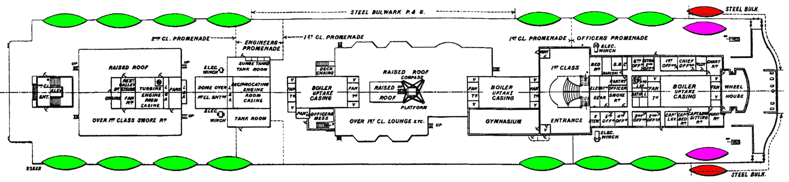
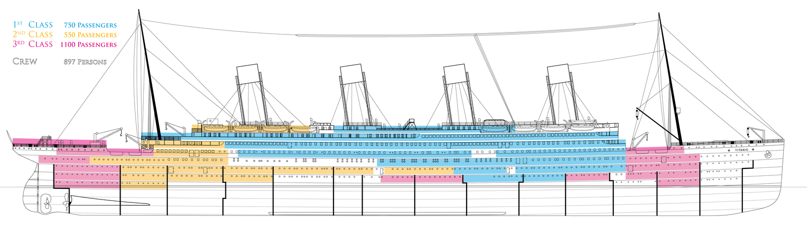
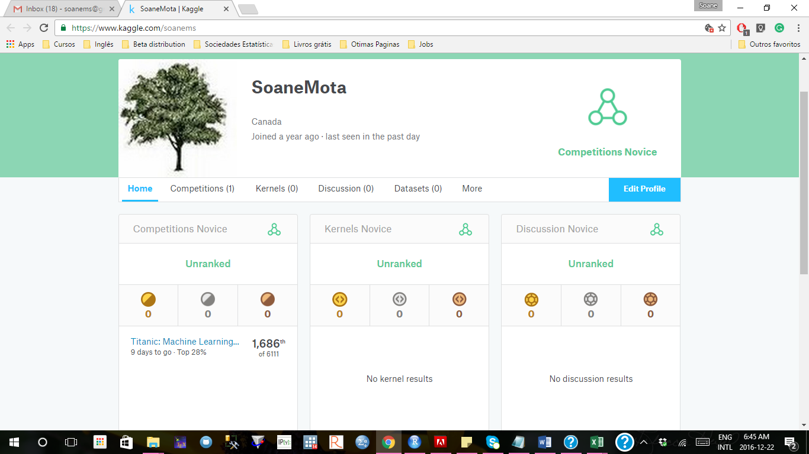

```{r setup, include=FALSE}
knitr::opts_chunk$set(echo = TRUE)
```

## Competition Description

The sinking of the RMS Titanic is one of the most infamous shipwrecks in history.  On April 15, 1912, during her maiden voyage, the Titanic sank after colliding with an iceberg, killing 1502 out of 2224 passengers and crew. This sensational tragedy shocked the international community and led to better safety regulations for ships.

One of the reasons that the shipwreck led to such loss of life was that there were not enough lifeboats for the passengers and crew. Although there was some element of luck involved in surviving the sinking, some groups of people were more likely to survive than others, such as women, children, and the upper-class.

In this challenge, we ask you to complete the analysis of what sorts of people were likely to survive. In particular, we ask you to apply the tools of machine learning to predict which passengers survived the tragedy.


Bellow, you will find my analysis for the Titanic challenge created by the Kaggle team. The Competiotion started on September 28, 2012 and will be finished on December 31, 2016.

To create my own solution for this challenge, I studied about the Titanic and its survivors. 

#The Titanic Decks 


#The Titanic Boat Deck plan with the lifeboats location



#Titanic Class System




Some information can be found in websites as <https://www.encyclopedia-titanica.org/> or <http://www.titanicfacts.net/titanic-passengers.html>.


After spending some time understanding the situation from where the data were obtained, I started digging the available datasets.

# Install Packages

First I installed all the R packages necessary for the analysis. The Packages can be loaded along the way.

```{r results='hide', message=FALSE, warning=FALSE}
#install.packages("htmlwidgets")
#install_github("easyGgplot2", "kassambara")
#install.packages("devtools")
#library(htmlwidgets)
library('ggplot2') 
library('ggthemes') 
library('scales') 
library('dplyr') 
library('mice') 
library('randomForest') 
library('Hmisc')
library('reshape2') 
library('stringr')
library('plyr') 
library('gridExtra')
library('devtools')
library('easyGgplot2')
library('vcd')
library('rpart')
library('rattle')
library('rpart.plot')
library('RColorBrewer')
library('caret') 

```


# Reading Datasets

Create functions during the analysis is always  important, especially when you have to deal with many repeated actions.

To facilitate the datasets reading, I used a function avaliable on the Internet. 

```{r}
readData <- function(fileName, VariableType, missingNA) {
        read.csv2(fileName, sep=",",dec = ".",
                  colClasses=VariableType,
                  na.strings=missingNA)
}

train.data <- "train.csv"
test.data <- "test.csv"
missingNA <- c("NA", "")
train.VariableType <- c('integer',   # PassengerId
                        'numeric',   # Survived 
                        'factor',    # Pclass
                        'character', # Name
                        'factor',    # Sex
                        'numeric',   # Age
                        'integer',   # SibSp
                        'integer',   # Parch
                        'character', # Ticket
                        'numeric',   # Fare
                        'character', # Cabin
                        'factor'     # Embarked
)

test.VariableType <- train.VariableType[-2]     ## There is no "Survived" variable in the test file

dt.train <- readData(train.data, train.VariableType, missingNA)
dt.test <- readData(test.data,test.VariableType, missingNA)
```

## Titanic train Dataset

The first step to work with Machine Learning is to evaluate the train dataset. 
For this step I summarizing the it.

```{r}
summary(dt.train)
```

From the summary table, we can see that the variables Age and Embarked have missing data and we will deal with them later.

Here, we labeled the categorical variables to make them easier to read.
```{r}
dt.train$Survived <- factor(dt.train$Survived, levels=c(1,0))
levels(dt.train$Survived) <- c("Survived", "Died")

dt.train$Pclass <- as.factor(dt.train$Pclass)
levels(dt.train$Pclass) <- c("1st Class", "2nd Class", "3rd Class")

dt.train$Sex <- factor(dt.train$Sex, levels=c("female", "male"))
levels(dt.train$Sex) <- c("Female", "Male")
```
```{r}
mosaicplot(Pclass ~ Sex,
           data=dt.train, main="Titanic Training Data Passenger Survival by Class",
           color=c("#8dd3c7", "#fb8072"), shade=FALSE,  xlab="", ylab="",
           off=c(0), cex.axis=1.4)
table(dt.train$Pclass,dt.train$Sex)
round(prop.table(table(dt.train$Pclass,dt.train$Sex),1),3)
```
Analysing the figure and the tables above, it is clear that there were more men than women in the Titanic traning dataset, especially in the third class.

```{r}
mosaicplot(Sex ~ Survived, 
           data=dt.train,
           color=c("#8dd3c7", "#fb8072"), shade=FALSE,  xlab="", ylab="",
           off=c(0), cex.axis=1.4,
           main="Titanic Training Data\nPassenger Survival by Sex")

table(dt.train$Sex,dt.train$Survived)
round(prop.table(table(dt.train$Sex,dt.train$Survived),1),3)
```      

```{r} 
mosaicplot(Pclass ~ Survived,
        data=dt.train,
        color=c("#8dd3c7", "#fb8072"), shade=FALSE,  xlab="", ylab="",
        off=c(0), cex.axis=1.4, 
        main="Titanic Training Data\nPassenger Survival by Class")
table(dt.train$Pclass,dt.train$Survived)
round(prop.table(table(dt.train$Pclass,dt.train$Survived),1),3)
```

The graphs and tables above show that the proportion of survivors are higher for female (74% vs 19%) and also between the first class passenger (63%), followed by the second (47%) and third class (24%), respectively.

```{r}
h<-ggplot(dt.train,aes(x = Pclass, fill = Survived,y = (..count..))) +
        geom_bar() + labs(y = "Count")+
        labs(title="Titanic Training Data: Survived by Class")
h1<-h+scale_fill_manual(values=c("#8dd3c7", "#fb8072"))
h2<-h1+scale_color_manual(values=c("#8dd3c7","#fb8072"))

p<-ggplot(subset(dt.train, dt.train$Sex=="Female"),aes(x = Pclass, fill = Survived,y = (..count..))) +
        geom_bar() + labs(y = "Count")+
        labs(title="Female by Class")
p1<-p + scale_y_continuous(limits = c(0, 350))
p2<-p1+scale_fill_manual(values=c("#8dd3c7", "#fb8072"))
p3<-p2+scale_color_manual(values=c("#8dd3c7","#fb8072"))

q<-ggplot(subset(dt.train, dt.train$Sex=="Male"),aes(x = Pclass, fill = Survived,y = (..count..))) +
        geom_bar() + labs(y = "Count")+
        labs(title="Male by Class")
q1<-q + scale_y_continuous(limits = c(0, 350))
q2<-q1+scale_fill_manual(values=c("#8dd3c7", "#fb8072"))
q3<-q2+scale_color_manual(values=c("#8dd3c7","#fb8072"))

grid.arrange(h2, ncol=1, nrow =1)
grid.arrange(p2, q2, ncol=1, nrow =2)
```

Now, let's do the analysis of the survivors for each class and gender. For the female, we observe only a few deaths on the first and the second classes, with most of them happening on the third class (almost 50%).
For male, we see higher proportion of survivors on the first class, but it does not look like to have a pattern as the worst survivor porportion is on the second class.

```{r}
mosaicplot(SibSp ~ Survived, 
           data=dt.train,
           color=c("#8dd3c7", "#fb8072"), shade=FALSE,  xlab="", ylab="",
           off=c(0), cex.axis=1.4,
           main="Titanic Training Data\nPassenger Survival by the Number of Siblings/Spouses Aboard")
table(dt.train$SibSp,dt.train$Survived)
round(prop.table(table(dt.train$SibSp,dt.train$Survived),1),3)
```


#Family mambers

The following is about the number of siblings and spouses, and parents and children aboard on the Titanic.

We can interpret that a person accompanied by one or two family members seems to had higher chance to survive. 

```{r results='hide', message=FALSE, warning=FALSE}
h<-ggplot(dt.train,aes(x=SibSp, fill=Survived, color=Survived)) +
        geom_histogram(position="identity", alpha=0.5,bins=10)  +
        labs(title="Titanic Training Data: \nNumber of Siblings/Spouses Aboard by Variable Survived")
h1<-h+scale_fill_manual(values=c("#8dd3c7", "#fb8072"))
h2<-h1+scale_color_manual(values=c("#8dd3c7","#fb8072"))

q<-ggplot(subset(dt.train, dt.train$Sex=="Female"),aes(x=SibSp, fill=Survived, color=Survived)) +
        geom_histogram(position="identity", alpha=0.5,bins=10)  +
        labs(title="Number of Siblings/Spouses Aboard for Female")
q1<-q+scale_fill_manual(values=c("#8dd3c7", "#fb8072"))
q2<-q1+scale_color_manual(values=c("#8dd3c7","#fb8072"))

p<-ggplot(subset(dt.train, dt.train$Sex=="Male"),aes(x=SibSp, fill=Survived, color=Survived)) +
        geom_histogram(position="identity", alpha=0.5,bins=10) +
        labs(title="Number of Siblings/Spouses Aboard for Male")
p1<-p+scale_fill_manual(values=c("#8dd3c7", "#fb8072"))
p2<-p1+scale_color_manual(values=c("#8dd3c7","#fb8072"))

grid.arrange(h2, ncol=1, nrow =1)
grid.arrange(q2, p2, ncol=1, nrow =2)
```

```{r}
mosaicplot(Parch ~ Survived, 
           data=dt.train,
           color=c("#8dd3c7", "#fb8072"), shade=FALSE,  xlab="", ylab="",
           off=c(0), cex.axis=1.4,
           main="Titanic Training Data\nPassenger Survival by the Number of Parents/Children Aboard")
table(dt.train$Parch,dt.train$Survived)
round(prop.table(table(dt.train$Parch,dt.train$Survived),1),3)
```

```{r results='hide', message=FALSE, warning=FALSE}
h<-ggplot(dt.train,aes(x=Parch, fill=Survived, color=Survived)) +
        geom_histogram(position="identity", alpha=0.5,bins=10)  +
        labs(title="Titanic Training Data: \nNumber of Parents/Children Aboard by Variable Survived")
h1<-h+scale_fill_manual(values=c("#8dd3c7", "#fb8072"))
h2<-h1+scale_color_manual(values=c("#8dd3c7","#fb8072"))

q<-ggplot(subset(dt.train, dt.train$Sex=="Female"),aes(x=Parch, fill=Survived, color=Survived)) +
        geom_histogram(position="identity", alpha=0.5,bins=10)  +
        labs(title="Number of Parents/Children Aboard for Female")
q1<-q+scale_fill_manual(values=c("#8dd3c7", "#fb8072"))
q2<-q1+scale_color_manual(values=c("#8dd3c7","#fb8072"))

p<-ggplot(subset(dt.train, dt.train$Sex=="Male"),aes(x=Parch, fill=Survived, color=Survived)) +
        geom_histogram(position="identity", alpha=0.5,bins=10) +
        labs(title="Number of Parents/Children Aboard for Male")
p1<-p+scale_fill_manual(values=c("#8dd3c7", "#fb8072"))
p2<-p1+scale_color_manual(values=c("#8dd3c7","#fb8072"))

grid.arrange(h2, ncol=1, nrow =1)
grid.arrange(q2, p2, ncol=1, nrow =2)
```

Most of the passengers embarked at the Southampton, followed by Cherbourg and Queenstown ports, respectivelly. Even though the highest proportion of survivor came from Cherbourg.

```{r}
dt.train$Embarked[which(is.na(dt.train$Embarked))] <- 'S'# The most commom value

mosaicplot(Embarked ~ Survived, 
           data=dt.train,
           color=c("#8dd3c7", "#fb8072"), shade=FALSE,  xlab="", ylab="",
           off=c(0), cex.axis=1.4,
           main="Titanic Training Data\nPassenger Survival by Port of Embarkation")
table(dt.train$Embarked,dt.train$Survived)
round(prop.table(table(dt.train$Embarked,dt.train$Survived),1),3)
```

There are several methods of imputation. For the age, I choose to use the median based on the title. Whivh I understend to have some relationship with the age of the individual. 

The variable title can be extracted from the name of each individual.
Grab title from passenger names.
```{r}
dt.train$Title <- gsub('(.*, )|(\\..*)', '', dt.train$Name)
table(dt.train$Title)

options(digits=2)
with(dt.train,bystats(Age, Title, 
        fun=function(x)c(Mean=mean(x),Median=median(x))))
```


I found on the internet the follow imputeMedian function  and it described as a function that receive the variable with missing (VarImpute), the variable used as filter (VarFilter) for the median imputation, and the levels of the filter variable (VarLevels).

```{r}
imputeMedian <- function(VarImpute, VarFilter, VarLevels) {
        for (i in VarLevels) {
                VarImpute[ which(VarFilter == i)] <- impute(VarImpute[ 
                        which( VarFilter == i)])
        }
        return (VarImpute)
}
```

```{r}
unique(dt.train$Title)

## list of all titles 
titles <- c("Mr","Mrs","Miss","Master","Don","Rev",
                     "Dr","Mme","Ms","Major","Lady","Sir",
                     "Mlle","Col","Capt","the Countess","Jonkheer","Dona")

dt.train$Age[which(dt.train$Title=="Dr")]

dt.train$Age <- imputeMedian(dt.train$Age,dt.train$Title,titles)
dt.train$Age[which(dt.train$Title=="Dr")] #Checking imputation
```

```{r results='hide', message=FALSE, warning=FALSE}
h<-ggplot(dt.train,aes(x=Age, fill=Survived, color=Survived)) +
        geom_histogram(position="identity", alpha=0.5,bins=90)  +
        labs(title="Titanic Training Data: Age by Variable Survived")
h1<-h+scale_fill_manual(values=c("#8dd3c7", "#fb8072"))
h2<-h1+scale_color_manual(values=c("#8dd3c7","#fb8072"))


q<-ggplot(subset(dt.train, dt.train$Sex=="Female"),aes(x=Age, fill=Survived, color=Survived)) +
        geom_histogram(position="identity", alpha=0.5,bins=90)  +
        labs(title="Age of Female")
q1<-q+scale_fill_manual(values=c("#8dd3c7", "#fb8072"))
q2<-q1+scale_color_manual(values=c("#8dd3c7","#fb8072"))

p<-ggplot(subset(dt.train, dt.train$Sex=="Male"),aes(x=Age, fill=Survived, color=Survived)) +
        geom_histogram(position="identity", alpha=0.5,bins=90) +
        labs(title="Age of Male")
p1<-p+scale_fill_manual(values=c("#8dd3c7", "#fb8072"))
p2<-p1+scale_color_manual(values=c("#8dd3c7","#fb8072"))
grid.arrange(h2, ncol=1, nrow =1)
grid.arrange(q2, p2, ncol=1, nrow =2)
```

Evaluating the distribution of survivors per age by gender, aparently the age was not important if the individual was female. For male, the highest proportion of survivors occoured for passengers under the age of 15. 


The follow histogram present the distribution of age per class.
```{r}
q<-ggplot(dt.train, aes(x=Age, fill=Pclass)) +
        geom_histogram(position="identity", alpha=0.5,bins=90)  +
        labs(title="Titanic Training Data: Age by Class")
q1<-q+scale_fill_manual(name="Class",values=c("blue","green", "red"))
q2<-q1+scale_color_manual(values=c("blue","green", "red"))
q2
```

Because the variable title has to many categories, we are going to create a new title according to the following rules.
 
```{r}
dt.train$NewTitle[dt.train$Title %in% c("Capt","Col","Don", "Dr", "Major","Rev")] <- 0 #There are a Woman Dr
dt.train$NewTitle[dt.train$Title %in% c("Lady", "Mme", "Mrs", "Ms", "the Countess")] <- 1
dt.train$NewTitle[dt.train$Title %in% c("Master")] <- 2
dt.train$NewTitle[dt.train$Title %in% c("Miss", "Mlle")] <- 3
dt.train$NewTitle[dt.train$Title %in% c("Mr", "Sir", "Jonkheer")] <- 4
dt.train$NewTitle <- factor(dt.train$NewTitle)
dt.train$NewTitle <- as.factor(dt.train$NewTitle)
levels(dt.train$NewTitle) <- c("Special", "Mrs", "Master","Miss","Mr")

table(dt.train$NewTitle, dt.train$Survived)
round(prop.table(table(dt.train$NewTitle, dt.train$Survived),1),3)
```

The tables above seems that the new title follow the idea to code "children and women first". Where Master (boys under the age 13), Miss and Mrs. have the highest survivor rate.

With this noted, I am going to create new variables that separate:
*children (under the age 13, independent of gender), adult women and adult male.
*children (under the age 15, independent of gender), adult women and adult male.


## Code: Women and Children First

Based on the fact that during a disaster the priority are women and children first, we are going to create a variable that separate children, women, and men.

```{r}
dt.train$WomanChild12_1st[dt.train$NewTitle %in% c("Master")] <- 0
dt.train$WomanChild12_1st[dt.train$NewTitle %in% c("Miss") & dt.train$Age<=12] <- 0
dt.train$WomanChild12_1st[dt.train$NewTitle %in% c("Miss") & dt.train$Age>12] <- 1
dt.train$WomanChild12_1st[dt.train$NewTitle %in% c("Mrs")] <- 1
dt.train$WomanChild12_1st[dt.train$NewTitle %in% c("Special") & dt.train$Sex=="Female"] <- 1 #For example for a Dr Woman
dt.train$WomanChild12_1st[dt.train$NewTitle %in% c("Special") & dt.train$Sex=="Male"] <- 2 
dt.train$WomanChild12_1st[dt.train$NewTitle %in% c("Mr")] <- 2
dt.train$WomanChild12_1st <- as.factor(dt.train$WomanChild12_1st)
levels(dt.train$WomanChild12_1st) <- c("Children", "Women", "Men")

table(dt.train$WomanChild12_1st, dt.train$Survived)
round(prop.table(table(dt.train$WomanChild12_1st, dt.train$Survived),1),3)
```
```{r}
table(dt.train$WomanChild12_1st, dt.train$NewTitle)
round(prop.table(table(dt.train$WomanChild12_1st, dt.train$NewTitle),1),3)
```
```{r}
h<-ggplot(dt.train,aes(x = WomanChild12_1st, fill = Survived,y = (..count..))) +
        geom_bar() + labs(y = "Count")+
        labs(title="Titanic Training Data: Women and Children 1st Survival",x="")
h1<-h+scale_fill_manual(name="Women & Children (< 13 years)\nFirst",values=c("#8dd3c7","#fb8072"))
h2<-h1+scale_color_manual(values=c("#8dd3c7","#fb8072"))
```


```{r}
dt.train$WomanChild14_1st[dt.train$NewTitle %in% c("Master")] <-0
dt.train$WomanChild14_1st[dt.train$NewTitle %in% c("Miss") & dt.train$Age<=14] <- 0
dt.train$WomanChild14_1st[dt.train$NewTitle %in% c("Miss") & dt.train$Age>14] <- 1
dt.train$WomanChild14_1st[dt.train$NewTitle %in% c("Mrs")] <- 1
dt.train$WomanChild14_1st[dt.train$NewTitle %in% c("Special") & dt.train$Sex=="Female"] <- 1 #For example for a Dr Woman
dt.train$WomanChild14_1st[dt.train$NewTitle %in% c("Special") & dt.train$Sex=="Male"] <- 2 
dt.train$WomanChild14_1st[dt.train$NewTitle %in% c("Mr") & dt.train$Age<=14] <- 0
dt.train$WomanChild14_1st[dt.train$NewTitle %in% c("Mr") & dt.train$Age>14] <- 2
dt.train$WomanChild14_1st <- as.factor(dt.train$WomanChild14_1st)
levels(dt.train$WomanChild14_1st) <- c("Children", "Women", "Men")

table(dt.train$WomanChild14_1st, dt.train$Survived)
round(prop.table(table(dt.train$WomanChild14_1st, dt.train$Survived),1),3)

```

```{r}
table(dt.train$WomanChild14_1st, dt.train$NewTitle)
round(prop.table(table(dt.train$WomanChild14_1st, dt.train$NewTitle),1),3)
```

```{r}
q<-ggplot(dt.train,aes(x = WomanChild14_1st, fill = Survived,y = (..count..))) +
        geom_bar() + labs(y = "Count")+ 
        labs(title="Titanic Training Data: Survival of Women and Children First code",x="")
q1<-q+scale_fill_manual(name="Women & Children (< 15 years)\nFirst",values=c("#8dd3c7","#fb8072"))
q2<-q1+scale_color_manual(values=c("#8dd3c7","#fb8072"))
grid.arrange(q2 ,ncol=1, nrow =1)
```

```{r}
p<-ggplot(dt.train, aes(x=Age, fill=WomanChild12_1st)) +
        geom_histogram(position="identity", alpha=0.5,bins=90)  +
                labs(title="Titanic Training Data: Survival of Women and Children First code")
p1<-p+scale_fill_manual(name="Women & Children (< 13 years)\nFirst",values=c("green","blue", "pink"))
p2<-p1+scale_color_manual(values=c("green","blue", "pink"))

q<-ggplot(dt.train, aes(x=Age, fill=WomanChild14_1st)) +
        geom_histogram(position="identity", alpha=0.5,bins=90)  +
        labs(title="Titanic Training Data: Survival of Women and Children First code")
q1<-q+scale_fill_manual(name="Women & Children (< 15 years)\nFirst",values=c("green","blue", "pink"))
q2<-q1+scale_color_manual(values=c("green","blue", "pink"))
grid.arrange(p2,q2 ,ncol=1, nrow =2)
```

For the traning dataset, it does not seem to have difference between choosing the children age up to 12 or 14 years old. But I will check if there is any difference in the models.

We also observed the proportion of survivors is higher for adult women, followed by children and last by men.

As we belive that a passenger with a family had more chance to survive, we are going to evaluate if the size of the family matters. For that, I will create a variable that counts the number of family member on the Titanic (combining number of children, siblings, parents and spouses).


```{r}
dt.train$FamilySize <- dt.train$SibSp + dt.train$Parch + 1 # Passeger + #Siblings + Spouse + Parents + Children Aboard
```

```{r}
boxplot(Age ~ FamilySize, data =dt.train, xlab="Family Size on the Ship", 
                ylab="Age (years)", main="Titanic Training Data")
```

```{r}
q <- ggplot(dt.train, aes(x=FamilySize, y=Age)) + geom_jitter(aes(colour = Survived),width = 0.25) 
q1 <- q + xlab("Family Size") 
q2 <- q1 + ylab("Age (years)")
q2
```

From the previous graphs, we can see that people with larger families were younger and had higher chance to die.

It seems that a passengers alone or with 5 o more family mamber on the ship are more likely to die, an individuo with a family with 2, 3 or 4 are more likely to survive. Because of that, I am going to categorize the family size, as follows.

```{r}
dt.train$Fsize[dt.train$FamilySize == 1] <- 1
dt.train$Fsize[dt.train$FamilySize == 2] <- 2
dt.train$Fsize[dt.train$FamilySize == 3] <- 3
dt.train$Fsize[dt.train$FamilySize == 4] <- 4
dt.train$Fsize[dt.train$FamilySize >= 5] <- 5 
dt.train$Fsize <- as.factor(dt.train$Fsize)

levels(dt.train$Fsize) <- c("1", "2", "3","4","5+")
table(dt.train$Fsize, dt.train$Survived)
round(prop.table(table(dt.train$Fsize, dt.train$Survived),1),3)
```

```{r}
with(dt.train,table(Fsize, Sex))
round(prop.table(table(dt.train$Fsize, dt.train$Sex),1),3)
```

```{r}
h<-ggplot(dt.train,aes(x = Fsize, fill = Survived,y = (..count..))) +
        geom_bar() + labs(y = "Count")+
        labs(title="Titanic Training Data: Survived by Family Size on the Ship")
h1<-h+scale_fill_manual(values=c("#8dd3c7", "#fb8072"))
h2<-h1+scale_color_manual(values=c("#8dd3c7","#fb8072"))
grid.arrange(h2, ncol=1, nrow =1)
```
```{r}
q <- ggplot(dt.train, aes(x=Fsize, y=Age)) + geom_jitter(aes(colour = Survived),width = 0.25) 
q1 <- q+ xlab("Family Size")
q2 <- q1 + ylab("Age (years)")
grid.arrange(q2, ncol=1, nrow =1)
```


Just for curiosity, I created a variable that estimates the family size on the training or test dataset. I did that so my models could adjust to the size of the family in the dataset evaluated.

First a created the FamilyID pasting the Family size Aboard on Titanic with the Passenger's Surname 

```{r}
dt.train$FamilyName <- gsub(",.*$", "", dt.train$Name)
dt.train$FamilyID <- paste(as.character(dt.train$FamilySize), dt.train$FamilyName, sep="")
```


With the FamilyID, we can see that even though I got the information that the Sage Family
had 11 family members aboard on the Titanic, we had information of only 7 members and all died. Maybe the other 4 members had survived and are on the test dataset.

The follow variable is meant to give a unique family identification for each passenger. For this analysis, we will assume that all the family member have the same number of family member on the Titanic, same Surname, same Embark port, and the same Ticket number.

Families with diferent Ticket numbers or who have Embarked in different port won't be classified as family.

```{r}
dt.train$FamilyID_Embk_Ticket <- paste(dt.train$FamilyID,dt.train$Embarked, as.character(dt.train$Ticket), sep="_")
dt.train$FamilyID_dataSet <- match(dt.train$FamilyID_Embk_Ticket, unique(dt.train$FamilyID_Embk_Ticket))
```

```{r}
dt.train$FamilySize_dataSet <- ave(dt.train$FamilyID_dataSet,dt.train$FamilyID_dataSet, FUN =length)
summary(dt.train$FamilySize_dataSet)
```

```{r}
table(dt.train$FamilySize_dataSet,dt.train$FamilySize)
plot(dt.train$FamilySize_dataSet,dt.train$FamilySize, xlab="Family Size in the dataset",
     ylab="Family Size on the Ship",main= "Titanic Training dataset")
```

As we were expecting, the variable family size on the train dataset worked well, assuming values equal or less than in the Titanic.


```{r}
with(dt.train,bystats(Fare, Pclass, 
        fun=function(x)c(Mean=mean(x),Median=median(x))))

q<-ggplot(dt.train, aes(x=Fare, fill=Pclass)) +
        geom_histogram(position="identity", alpha=0.5,bins=50)  +
        labs(title="Titanic Training Data: Fare by Class")
q1<-q+scale_fill_manual(name="Class",values=c("green","blue", "red"))
q2<-q1+scale_color_manual(values=c("green","blue", "red"))
grid.arrange(q2, ncol=1, nrow =1)
```
Checking the ticket price(fare) by class, apparently the median increase with the class.
```{r}
with(dt.train,bystats(Fare, FamilySize, 
        fun=function(x)c(Mean=mean(x),Median=median(x))))

with(dt.train, {
        boxplot(Fare ~ FamilySize, xlab="Family Size on the Titanic", 
                ylab="Fare", main="Titanic Training Data", col=2:10)
})

with(dt.train,bystats(Fare, Fsize, 
        fun=function(x)c(Mean=mean(x),Median=median(x))))

with(dt.train, {
        boxplot(Fare ~ Fsize, xlab="Family Size on the Titanic", 
                ylab="Fare", main="Titanic Training Data", col=2:10)
        })
```

From the boxplots above, the fare tends to be different only if the passenger were alone, with the lowest median.


#Models

To submit the models predictions on the Kaggle competition, I choose the ones with highest accuracy in the training dataset.


Table 1: Accuracy of adjusted models on the training datase.

Model|Logistic|Decision Tree|Random Forest
|:---:|:---:|:---:|:---:|
|1|0.787|0.787|0.787|
|2|0.787|0.792|0.798|
|3|0.796|0.820|0.818|
|4|0.790|0.835|0.857|
|5|0.793|0.835|0.850|
|6|0.804|0.835|0.869|
|7|0.796|0.840|0.848|
|8|0.806|0.840|0.864|
|9|0.826|0.841|0.850|
|10|0.819|0.841|0.868|
|11|0.792|0.832|0.846|
|12|0.810|0.835|0.864|
|13|0.833|0.834|0.852|
|14|0.831|0.834|0.861|
|15|0.834|0.835|0.844|
|16|0.827|0.835|0.860|
|17|0.832|0.834|0.844|
|18|0.832|0.834|0.834|
|19|0.833|0.835|0.834|
|20|0.833|||


From the table above, I selected the following models.
        * Model 9: Decision Tree (Survived ~ Sex + Age + Pclass + Fsize)
                ** (accuracy in the train dataset = 0.841, Kaggle score = 0.79426)

        * Model 6: Random Forest (Survived ~ Sex + Age + Pclass + SibSp + Parch + Embarked)
                ** (accuracy in the train dataset = 0.869, Kaggle score = 0.79426)

        * Model 19: Logistic (Survived ~ Pclass + Fsize + WomanChild12_1st)
                ** (accuracy in the train dataset = 0.833, Kaggle score = 0.78947)

        * Model 13: Logistic (Survived ~ Sex + Age + Pclass + Fsize + NewTitle)
                ** (accuracy in the train dataset = 0.833, Kaggle score = 0.78469)
        
        * Model 20: Logistic with Stepwise 
                **(Survived ~ Age + Pclass +  Fsize + FamilySize_dataSet + WomanChild12_1st)
                ** (accuracy in the train dataset = 0.833, Kaggle score = 0.78469)


#Conclusions

I did the analysis of the Titanic data to predict who died and survived based on selected variables. The best models used variables as sex, age, class, family size, in dataset family size, title and the "children and women first" variable.

I am confortable to say that the gender, age and class are the major factors for survival or death in the Titanic tragedy. But also other factors interfered as the title, family size and embarked port.

The best models, acoording to the Kaggle score, are the 9 (decision tree) and 6 (random Forest), which land me on the top 28%. According to the training dataset, the accuracy for the random Forest is higher than the for the decision tree.

For future work, would be interesting evaluate the distance between the passenger's cabin to the saving boats. The variable can be created using the ticket number to identify the cabin position in the ship and compute a vectorial distance. This is iteresting because, in a moment of desperate, people closer to the saving boats may had higher chances to survive. From the figures in the begging of this work, we see that first and second classes are closer to the life boats.


#My Kaggle score in the Titanic Challenge




#APPENDIX

```{r}
set.seed(12345)
```

## Model 1: Survived ~ Sex
###Logistic (Accuracy : 0.787)

```{r}
fit1.log <- glm(Survived ~ Sex , family = binomial(link='logit'), data = dt.train)
summary(fit1.log)
dt.train$pred.fit1.log <- predict.glm(fit1.log, newdata = dt.train, type = "response")
dt.train$pred.fit1.log <- ifelse(dt.train$pred.fit1.log > 0.5,1,0)
dt.train$pred.fit1.log <- factor(dt.train$pred.fit1.log, levels = c(0,1),labels = c("Survived","Died"))
confusionMatrix(dt.train$pred.fit1.log, dt.train$Survived)
```

###Decision Tree ( Accuracy : 0.787)
```{r}
fit1.dt <- rpart(Survived ~ Sex, data=dt.train, method="class")
fancyRpartPlot(fit1.dt)

dt.train$pred.fit1.dt <- predict(fit1.dt, newdata=dt.train,type='class')
confusionMatrix(dt.train$pred.fit1.dt, dt.train$Survived)
```

##Random Tree ( Accuracy : 0.787)
```{r}
fit1.rf <- randomForest(Survived ~ Sex,
                    data=dt.train, importance=TRUE, ntree=2000)
dt.train$pred.fit1.rf <- predict(fit1.rf, newdata=dt.train,type='class')
confusionMatrix(dt.train$pred.fit1.rf, dt.train$Survived)
```


# Model 2: Survived ~ Sex + Age
### Logistic (Accuracy : 0.787)

```{r}
fit2.log <- glm(Survived ~ Sex + Age , family = binomial(link='logit'), data = dt.train)
summary(fit2.log)
dt.train$pred.fit2.log <- predict.glm(fit2.log, newdata = dt.train, type = "response")
dt.train$pred.fit2.log <- ifelse(dt.train$pred.fit2.log > 0.5,1,0)
dt.train$pred.fit2.log <- factor(dt.train$pred.fit2.log, levels = c(0,1),labels = c("Survived","Died"))
confusionMatrix(dt.train$pred.fit2.log, dt.train$Survived)
```
### Decision Tree ( Accuracy : 0.792)
```{r}
fit2.dt <- rpart(Survived ~ Sex + Age, data=dt.train, method="class")
fancyRpartPlot(fit2.dt)
dt.train$pred.fit2.dt <- predict(fit2.dt, newdata=dt.train,type='class')
confusionMatrix(dt.train$pred.fit2.dt, dt.train$Survived)
```

### Random Tree ( Accuracy : 0.798)
```{r}
fit2.rf <- randomForest(Survived ~ Sex + Age,
                    data=dt.train, importance=TRUE, ntree=2000)
dt.train$pred.fit2.rf <- predict(fit2.rf, newdata=dt.train,type='class')
confusionMatrix(dt.train$pred.fit2.rf, dt.train$Survived)

# Look at variable importance
varImpPlot(fit2.rf)
```


## Model 3: Survived ~ Sex + Age + Pclass 
### Logistic (Accuracy : 0.796)

```{r}
fit3.log <- glm(Survived ~ Sex + Age + Pclass, family = binomial(link='logit'), data = dt.train)
summary(fit3.log)
dt.train$pred.fit3.log <- predict.glm(fit3.log, newdata = dt.train, type = "response")
dt.train$pred.fit3.log <- ifelse(dt.train$pred.fit3.log > 0.5,1,0)
dt.train$pred.fit3.log <- factor(dt.train$pred.fit3.log, levels = c(0,1),labels = c("Survived","Died"))
confusionMatrix(dt.train$pred.fit3.log, dt.train$Survived)
```
### Decision Tree ( Accuracy : 0.82 )

```{r}
fit3.dt <- rpart(Survived ~ Sex + Age + Pclass, data=dt.train, method="class")
fancyRpartPlot(fit3.dt)

dt.train$pred.fit3.dt <- predict(fit3.dt, newdata=dt.train,type='class')
confusionMatrix(dt.train$pred.fit3.dt, dt.train$Survived)
```
### Random Tree ( Accuracy : 0.818)
```{r}
fit3.rf <- randomForest(Survived ~ Sex + Age + Pclass,
                    data=dt.train, importance=TRUE, ntree=2000)
dt.train$pred.fit3.rf <- predict(fit3.rf, newdata=dt.train,type='class')
confusionMatrix(dt.train$pred.fit3.rf, dt.train$Survived)

# Look at variable importance
varImpPlot(fit3.rf)
```
## Model 4: Survived ~ Sex + Age + Pclass + SibSp
### Logistic (Accuracy : 0.79)
```{r}
fit4.log <- glm(Survived ~ Sex + Age + Pclass + SibSp, family = binomial(link='logit'), data = dt.train)
summary(fit4.log)
dt.train$pred.fit4.log <- predict.glm(fit4.log, newdata = dt.train, type = "response")
dt.train$pred.fit4.log <- ifelse(dt.train$pred.fit4.log > 0.5,1,0)
dt.train$pred.fit4.log <- factor(dt.train$pred.fit4.log, levels = c(0,1),labels = c("Survived","Died"))
confusionMatrix(dt.train$pred.fit4.log, dt.train$Survived)
```
### Decision Tree( Accuracy : 0.835)
```{r}
fit4.dt <- rpart(Survived ~ Sex + Age + Pclass + SibSp, data=dt.train, method="class")
fancyRpartPlot(fit4.dt)

dt.train$pred.fit4.dt <- predict(fit4.dt, newdata=dt.train,type='class')
confusionMatrix(dt.train$pred.fit4.dt, dt.train$Survived)
```
### Random Tree ( Accuracy : 0.857)

```{r}
fit4.rf <- randomForest(Survived ~ Sex + Age + Pclass + SibSp,
                    data=dt.train, importance=TRUE, ntree=2000)
dt.train$pred.fit4.rf <- predict(fit4.rf, newdata=dt.train,type='class')
confusionMatrix(dt.train$pred.fit4.rf, dt.train$Survived)

# Look at variable importance
varImpPlot(fit4.rf)
```

## Model 5: Survived ~ Sex + Age + Pclass + SibSp + Parch
### Logistic (Accuracy : 0.793)
```{r}
fit5.log <- glm(Survived ~ Sex + Age + Pclass + SibSp + Parch, family = binomial(link='logit'), data = dt.train)
summary(fit5.log)
dt.train$pred.fit5.log <- predict.glm(fit5.log, newdata = dt.train, type = "response")
dt.train$pred.fit5.log <- ifelse(dt.train$pred.fit5.log > 0.5,1,0)
dt.train$pred.fit5.log <- factor(dt.train$pred.fit5.log, levels = c(0,1),labels = c("Survived","Died"))
confusionMatrix(dt.train$pred.fit5.log, dt.train$Survived)
```
### Decision Tree ( Accuracy : 0.835)
```{r}
fit5.dt <- rpart(Survived ~ Sex + Age + Pclass + SibSp + Parch, data=dt.train, method="class")
fancyRpartPlot(fit5.dt)

dt.train$pred.fit5.dt <- predict(fit5.dt, newdata=dt.train,type='class')
confusionMatrix(dt.train$pred.fit5.dt, dt.train$Survived)
```
### Random Tree ( Accuracy : 0.85)
```{r}
fit5.rf <- randomForest(Survived ~ Sex + Age + Pclass + SibSp + Parch,
                    data=dt.train, importance=TRUE, ntree=2000)
dt.train$pred.fit5.rf <- predict(fit5.rf, newdata=dt.train,type='class')
confusionMatrix(dt.train$pred.fit5.rf, dt.train$Survived)

# Look at variable importance
varImpPlot(fit5.rf)
```

## Model 6: Survived ~ Sex + Age + Pclass + SibSp + Parch + Embarked 
### Logistic (Accuracy : 0.804)
```{r}
fit6.log <- glm(Survived ~ Sex + Age + Pclass + SibSp + Parch + Embarked, family = binomial(link='logit'), data = dt.train)
summary(fit6.log)
dt.train$pred.fit6.log <- predict.glm(fit6.log, newdata = dt.train, type = "response")
dt.train$pred.fit6.log <- ifelse(dt.train$pred.fit6.log > 0.5,1,0)
dt.train$pred.fit6.log <- factor(dt.train$pred.fit6.log, levels = c(0,1),labels = c("Survived","Died"))
confusionMatrix(dt.train$pred.fit6.log, dt.train$Survived)
```

### Decision Tree ( Accuracy : 0.835)
```{r}
fit6.dt <- rpart(Survived ~ Sex + Age + Pclass + SibSp + Parch + Embarked, data=dt.train, method="class")
fancyRpartPlot(fit6.dt)

dt.train$pred.fit6.dt <- predict(fit6.dt, newdata=dt.train,type='class')
confusionMatrix(dt.train$pred.fit6.dt, dt.train$Survived)
```

### Random Tree ( Accuracy : 0.869)
```{r}
fit6.rf <- randomForest(Survived ~ Sex + Age + Pclass + SibSp + Parch + Embarked,
                    data=dt.train, importance=TRUE, ntree=2000)
dt.train$pred.fit6.rf <- predict(fit6.rf, newdata=dt.train,type='class')
confusionMatrix(dt.train$pred.fit6.rf, dt.train$Survived)

# Look at variable importance
varImpPlot(fit6.rf)
```

## Model 7: Survived ~ Sex + Age + Pclass + FamilySize
### Logistic (Accuracy : 0.796)
```{r}
fit7.log <- glm(Survived ~ Sex + Age + Pclass + FamilySize, family = binomial(link='logit'), data = dt.train)
summary(fit7.log)
dt.train$pred.fit7.log <- predict.glm(fit7.log, newdata = dt.train, type = "response")
dt.train$pred.fit7.log <- ifelse(dt.train$pred.fit7.log > 0.5,1,0)
dt.train$pred.fit7.log <- factor(dt.train$pred.fit7.log, levels = c(0,1),labels = c("Survived","Died"))
confusionMatrix(dt.train$pred.fit7.log, dt.train$Survived)
```
### Decision Tree( Accuracy : 0.84)
```{r}
fit7.dt <- rpart(Survived ~ Sex + Age + Pclass + FamilySize, data=dt.train, method="class")
fancyRpartPlot(fit7.dt)

dt.train$pred.fit7.dt <- predict(fit7.dt, newdata=dt.train,type='class')
confusionMatrix(dt.train$pred.fit7.dt, dt.train$Survived)
```
### Random Tree ( Accuracy : 0.848)
```{r}
fit7.rf <- randomForest(Survived ~ Sex + Age + Pclass + FamilySize,
                    data=dt.train, importance=TRUE, ntree=2000)
dt.train$pred.fit7.rf <- predict(fit7.rf, newdata=dt.train,type='class')
confusionMatrix(dt.train$pred.fit7.rf, dt.train$Survived)

# Look at variable importance
varImpPlot(fit7.rf)
```

## Model 8: Survived ~ Sex + Age + Pclass + FamilySize + Embarked
### Logistic (Accuracy : 0.806)
```{r}
fit8.log <- glm(Survived ~ Sex + Age + Pclass + FamilySize + Embarked , family = binomial(link='logit'), data = dt.train)
summary(fit8.log)
dt.train$pred.fit8.log <- predict.glm(fit8.log, newdata = dt.train, type = "response")
dt.train$pred.fit8.log <- ifelse(dt.train$pred.fit8.log > 0.5,1,0)
dt.train$pred.fit8.log <- factor(dt.train$pred.fit8.log, levels = c(0,1),labels = c("Survived","Died"))
confusionMatrix(dt.train$pred.fit8.log, dt.train$Survived)
```
### Decision Tree ( Accuracy : 0.84)
```{r}
fit8.dt <- rpart(Survived ~ Sex + Age + Pclass + FamilySize + Embarked , data=dt.train, method="class")
fancyRpartPlot(fit8.dt)

dt.train$pred.fit8.dt <- predict(fit8.dt, newdata=dt.train,type='class')
confusionMatrix(dt.train$pred.fit8.dt, dt.train$Survived)
```
### Random Tree ( Accuracy : 0.864)
```{r}
fit8.rf <- randomForest(Survived ~ Sex + Age + Pclass + FamilySize + Embarked ,
                    data=dt.train, importance=TRUE, ntree=2000)
dt.train$pred.fit8.rf <- predict(fit8.rf, newdata=dt.train,type='class')
confusionMatrix(dt.train$pred.fit8.rf, dt.train$Survived)

# Look at variable importance
varImpPlot(fit8.rf)
```


## Model 9: Survived ~ Sex + Age + Pclass + Fsize
### Logistic (Accuracy : 0.826)
```{r}
fit9.log <- glm(Survived ~ Sex + Age + Pclass + Fsize, family = binomial(link='logit'), data = dt.train)
summary(fit9.log)
dt.train$pred.fit9.log <- predict.glm(fit9.log, newdata = dt.train, type = "response")
dt.train$pred.fit9.log <- ifelse(dt.train$pred.fit9.log > 0.5,1,0)
dt.train$pred.fit9.log <- factor(dt.train$pred.fit9.log, levels = c(0,1),labels = c("Survived","Died"))
confusionMatrix(dt.train$pred.fit9.log, dt.train$Survived)
```
### Decision Tree ( Accuracy : 0.841)
```{r}
fit9.dt <- rpart(Survived ~ Sex + Age + Pclass + Fsize, data=dt.train, method="class")
fancyRpartPlot(fit9.dt)

dt.train$pred.fit9.dt <- predict(fit9.dt, newdata=dt.train,type='class')
confusionMatrix(dt.train$pred.fit9.dt, dt.train$Survived)
```
### Random Tree ( Accuracy : 0.85)
```{r}
fit9.rf <- randomForest(Survived ~ Sex + Age + Pclass + Fsize,
                    data=dt.train, importance=TRUE, ntree=2000)
dt.train$pred.fit9.rf <- predict(fit9.rf, newdata=dt.train,type='class')
confusionMatrix(dt.train$pred.fit9.rf, dt.train$Survived)

# Look at variable importance
varImpPlot(fit9.rf)
```


## Model 10: Survived ~ Sex + Age + Pclass + Fsize + Embarked
### Logistic (Accuracy :  0.819)
```{r}
fit10.log <- glm(Survived ~ Sex + Age + Pclass + Fsize + Embarked , family = binomial(link='logit'), data = dt.train)
summary(fit10.log)
dt.train$pred.fit10.log <- predict.glm(fit10.log, newdata = dt.train, type = "response")
dt.train$pred.fit10.log <- ifelse(dt.train$pred.fit10.log > 0.5,1,0)
dt.train$pred.fit10.log <- factor(dt.train$pred.fit10.log, levels = c(0,1),labels = c("Survived","Died"))
confusionMatrix(dt.train$pred.fit10.log, dt.train$Survived)
```
### Decision Tree ( Accuracy : 0.841)
```{r}
fit10.dt <- rpart(Survived ~ Sex + Age + Pclass + Fsize + Embarked , data=dt.train, method="class")
fancyRpartPlot(fit10.dt)

dt.train$pred.fit10.dt <- predict(fit10.dt, newdata=dt.train,type='class')
confusionMatrix(dt.train$pred.fit10.dt, dt.train$Survived)
```
### Random Tree ( Accuracy : 0.868)
```{r}
fit10.rf <- randomForest(Survived ~ Sex + Age + Pclass + Fsize + Embarked ,
                    data=dt.train, importance=TRUE, ntree=2000)
dt.train$pred.fit10.rf <- predict(fit10.rf, newdata=dt.train,type='class')
confusionMatrix(dt.train$pred.fit10.rf, dt.train$Survived)

# Look at variable importance
varImpPlot(fit10.rf)
```


## Model 11: Survived ~ Sex + Age + Pclass + FamilySize_dataSet
### Logistic (Accuracy : 0.792)
```{r}
fit11.log <- glm(Survived ~ Sex + Age + Pclass + FamilySize_dataSet, family = binomial(link='logit'), data = dt.train)
summary(fit11.log)
dt.train$pred.fit11.log <- predict.glm(fit11.log, newdata = dt.train, type = "response")
dt.train$pred.fit11.log <- ifelse(dt.train$pred.fit11.log > 0.5,1,0)
dt.train$pred.fit11.log <- factor(dt.train$pred.fit11.log, levels = c(0,1),labels = c("Survived","Died"))
confusionMatrix(dt.train$pred.fit11.log, dt.train$Survived)
```
### Decision Tree( Accuracy : 0.832)
```{r}
fit11.dt <- rpart(Survived ~ Sex + Age + Pclass + FamilySize_dataSet, data=dt.train, method="class")
fancyRpartPlot(fit11.dt)

dt.train$pred.fit11.dt <- predict(fit11.dt, newdata=dt.train,type='class')
confusionMatrix(dt.train$pred.fit11.dt, dt.train$Survived)
```
### Random Tree ( Accuracy : 0.846)
```{r}
fit11.rf <- randomForest(Survived ~ Sex + Age + Pclass + FamilySize_dataSet,
                    data=dt.train, importance=TRUE, ntree=2000)
dt.train$pred.fit11.rf <- predict(fit11.rf, newdata=dt.train,type='class')
confusionMatrix(dt.train$pred.fit11.rf, dt.train$Survived)

# Look at variable importance
varImpPlot(fit11.rf)
```


## Model 12: Survived ~ Sex + Age + Pclass + FamilySize_dataSet + Embarked
### Logistic (Accuracy :  0.81)
```{r}
fit12.log <- glm(Survived ~ Sex + Age + Pclass + FamilySize_dataSet + Embarked , family = binomial(link='logit'), data = dt.train)
summary(fit12.log)
dt.train$pred.fit12.log <- predict.glm(fit12.log, newdata = dt.train, type = "response")
dt.train$pred.fit12.log <- ifelse(dt.train$pred.fit12.log > 0.5,1,0)
dt.train$pred.fit12.log <- factor(dt.train$pred.fit12.log, levels = c(0,1),labels = c("Survived","Died"))
confusionMatrix(dt.train$pred.fit12.log, dt.train$Survived)
```
### Decision Tree ( Accuracy : 0.835)
```{r}
fit12.dt <- rpart(Survived ~ Sex + Age + Pclass + FamilySize_dataSet + Embarked , data=dt.train, method="class")
fancyRpartPlot(fit12.dt)

dt.train$pred.fit12.dt <- predict(fit12.dt, newdata=dt.train,type='class')
confusionMatrix(dt.train$pred.fit12.dt, dt.train$Survived)
```
### Random Tree ( Accuracy : 0.864)
```{r}
fit12.rf <- randomForest(Survived ~ Sex + Age + Pclass + FamilySize_dataSet + Embarked ,
                    data=dt.train, importance=TRUE, ntree=2000)
dt.train$pred.fit12.rf <- predict(fit12.rf, newdata=dt.train,type='class')
confusionMatrix(dt.train$pred.fit12.rf, dt.train$Survived)

# Look at variable importance
varImpPlot(fit12.rf)
```


## Model 13: Survived ~ Sex + Age + Pclass + Fsize + NewTitle  
### Logistic (Accuracy : 0.833)
```{r}
fit13.log <- glm(Survived ~ Sex + Age + Pclass + Fsize + NewTitle, family = binomial(link='logit'), data = dt.train)
summary(fit13.log)
dt.train$pred.fit13.log <- predict.glm(fit13.log, newdata = dt.train, type = "response")
dt.train$pred.fit13.log <- ifelse(dt.train$pred.fit13.log > 0.5,1,0)
dt.train$pred.fit13.log <- factor(dt.train$pred.fit13.log, levels = c(0,1),labels = c("Survived","Died"))
confusionMatrix(dt.train$pred.fit13.log, dt.train$Survived)
```
### Decision Tree( Accuracy : 0.834)
```{r}
fit13.dt <- rpart(Survived ~ Sex + Age + Pclass + Fsize + NewTitle, data=dt.train, method="class")
fancyRpartPlot(fit13.dt)

dt.train$pred.fit13.dt <- predict(fit13.dt, newdata=dt.train,type='class')
confusionMatrix(dt.train$pred.fit13.dt, dt.train$Survived)
```
### Random Tree ( Accuracy : 0.852)
```{r}
fit13.rf <- randomForest(Survived ~ Sex + Age + Pclass + Fsize + NewTitle,
                    data=dt.train, importance=TRUE, ntree=2000)
dt.train$pred.fit13.rf <- predict(fit13.rf, newdata=dt.train,type='class')
confusionMatrix(dt.train$pred.fit13.rf, dt.train$Survived)

# Look at variable importance
varImpPlot(fit13.rf)
```


## Model 14: Survived ~ Sex + Age + Pclass + Fsize + NewTitle + Embarked
### Logistic (Accuracy : 0.831)
```{r}
fit14.log <- glm(Survived ~ Sex + Age + Pclass + Fsize + NewTitle + Embarked, family = binomial(link='logit'), data = dt.train)
summary(fit14.log)
dt.train$pred.fit14.log <- predict.glm(fit14.log, newdata = dt.train, type = "response")
dt.train$pred.fit14.log <- ifelse(dt.train$pred.fit14.log > 0.5,1,0)
dt.train$pred.fit14.log <- factor(dt.train$pred.fit14.log, levels = c(0,1),labels = c("Survived","Died"))
confusionMatrix(dt.train$pred.fit14.log, dt.train$Survived)
```
### Decision Tree ( Accuracy : 0.834)
```{r}
fit14.dt <- rpart(Survived ~ Sex + Age + Pclass + Fsize + NewTitle + Embarked, data=dt.train, method="class")
fancyRpartPlot(fit14.dt)

dt.train$pred.fit14.dt <- predict(fit14.dt, newdata=dt.train,type='class')
confusionMatrix(dt.train$pred.fit14.dt, dt.train$Survived)
```
##  Random Tree ( Accuracy : 0.861)
```{r}
fit14.rf <- randomForest(Survived ~ Sex + Age + Pclass + Fsize + NewTitle + Embarked,
                    data=dt.train, importance=TRUE, ntree=2000)
dt.train$pred.fit14.rf <- predict(fit14.rf, newdata=dt.train,type='class')
confusionMatrix(dt.train$pred.fit14.rf, dt.train$Survived)

# Look at variable importance
varImpPlot(fit14.rf)
```
## Model 15: Survived ~ Sex + Age + Pclass + Fsize + WomanChild12_1st
### Logistic (Accuracy : 0.834)
```{r}
fit15.log <- glm(Survived ~ Sex + Age + Pclass + Fsize + WomanChild12_1st , family = binomial(link='logit'), data = dt.train)
summary(fit15.log)
dt.train$pred.fit15.log <- predict.glm(fit15.log, newdata = dt.train, type = "response")
dt.train$pred.fit15.log <- ifelse(dt.train$pred.fit15.log > 0.5,1,0)
dt.train$pred.fit15.log <- factor(dt.train$pred.fit15.log, levels = c(0,1),labels = c("Survived","Died"))
confusionMatrix(dt.train$pred.fit15.log, dt.train$Survived)
```
### Decision Tree ( Accuracy : 0.835)
```{r}
fit15.dt <- rpart(Survived ~ Sex + Age + Pclass + Fsize + WomanChild12_1st , data=dt.train, method="class")
fancyRpartPlot(fit15.dt)

dt.train$pred.fit15.dt <- predict(fit15.dt, newdata=dt.train,type='class')
confusionMatrix(dt.train$pred.fit15.dt, dt.train$Survived)
```
##  Random Tree ( Accuracy : 0.844)
```{r}
fit15.rf <- randomForest(Survived ~ Sex + Age + Pclass + Fsize + WomanChild12_1st ,
                    data=dt.train, importance=TRUE, ntree=2000)
dt.train$pred.fit15.rf <- predict(fit15.rf, newdata=dt.train,type='class')
confusionMatrix(dt.train$pred.fit15.rf, dt.train$Survived)

# Look at variable importance
varImpPlot(fit15.rf)
```


## Model 16: Survived ~ Sex + Age + Pclass + Fsize + WomanChild12_1st + Embarked
### Logistic (Accuracy : 0.827)
```{r}
fit16.log <- glm(Survived ~ Sex + Age + Pclass + Fsize + WomanChild12_1st + Embarked, family = binomial(link='logit'), data = dt.train)
summary(fit16.log)
dt.train$pred.fit16.log <- predict.glm(fit16.log, newdata = dt.train, type = "response")
dt.train$pred.fit16.log <- ifelse(dt.train$pred.fit16.log > 0.5,1,0)
dt.train$pred.fit16.log <- factor(dt.train$pred.fit16.log, levels = c(0,1),labels = c("Survived","Died"))
confusionMatrix(dt.train$pred.fit16.log, dt.train$Survived)
```
### Decision Tree( Accuracy : 0.835)
```{r}
fit16.dt <- rpart(Survived ~ Sex + Age + Pclass + Fsize + WomanChild12_1st + Embarked, data=dt.train, method="class")
fancyRpartPlot(fit16.dt)

dt.train$pred.fit16.dt <- predict(fit16.dt, newdata=dt.train,type='class')
confusionMatrix(dt.train$pred.fit16.dt, dt.train$Survived)
```

### Random Tree ( Accuracy : 0.860)
```{r}
fit16.rf <- randomForest(Survived ~ Sex + Age + Pclass + Fsize + WomanChild12_1st + Embarked,
                    data=dt.train, importance=TRUE, ntree=2000)
dt.train$pred.fit16.rf <- predict(fit16.rf, newdata=dt.train,type='class')
confusionMatrix(dt.train$pred.fit16.rf, dt.train$Survived)

# Look at variable importance
varImpPlot(fit16.rf)
```


## Model 17: Survived ~ Sex + Age + Pclass + Fsize + WomanChild14_1st 
### Logistic (Accuracy : 0.832)
```{r}
fit17.log <- glm(Survived ~ Sex + Age + Pclass + Fsize + WomanChild14_1st , family = binomial(link='logit'), data = dt.train)
summary(fit17.log)
dt.train$pred.fit17.log <- predict.glm(fit17.log, newdata = dt.train, type = "response")
dt.train$pred.fit17.log <- ifelse(dt.train$pred.fit17.log > 0.5,1,0)
dt.train$pred.fit17.log <- factor(dt.train$pred.fit17.log, levels = c(0,1),labels = c("Survived","Died"))
confusionMatrix(dt.train$pred.fit17.log, dt.train$Survived)
```
### Decision Tree ( Accuracy : 0.834)
```{r}
fit17.dt <- rpart(Survived ~ Sex + Age + Pclass + Fsize + WomanChild14_1st , data=dt.train, method="class")
fancyRpartPlot(fit17.dt)

dt.train$pred.fit17.dt <- predict(fit17.dt, newdata=dt.train,type='class')
confusionMatrix(dt.train$pred.fit17.dt, dt.train$Survived)
```
### Random Tree ( Accuracy : 0.844)
```{r}
fit17.rf <- randomForest(Survived ~ Sex + Age + Pclass + Fsize + WomanChild14_1st,
                    data=dt.train, importance=TRUE, ntree=2000)
dt.train$pred.fit17.rf <- predict(fit17.rf, newdata=dt.train,type='class')
confusionMatrix(dt.train$pred.fit17.rf, dt.train$Survived)

# Look at variable importance
varImpPlot(fit17.rf)
```


## Model 18: Survived ~ Pclass + Fsize + WomanChild14_1st 
### Logistic (Accuracy : 0.832)
```{r}
fit18.log <- glm(Survived ~ Pclass + Fsize + WomanChild14_1st , family = binomial(link='logit'), data = dt.train)
summary(fit18.log)
dt.train$pred.fit18.log <- predict.glm(fit18.log, newdata = dt.train, type = "response")
dt.train$pred.fit18.log <- ifelse(dt.train$pred.fit18.log > 0.5,1,0)
dt.train$pred.fit18.log <- factor(dt.train$pred.fit18.log, levels = c(0,1),labels = c("Survived","Died"))
confusionMatrix(dt.train$pred.fit18.log, dt.train$Survived)
```
### Decision Tree ( Accuracy : 0.834)
```{r}
fit18.dt <- rpart(Survived ~ Pclass + Fsize + WomanChild14_1st , data=dt.train, method="class")
fancyRpartPlot(fit18.dt)

dt.train$pred.fit18.dt <- predict(fit18.dt, newdata=dt.train,type='class')
confusionMatrix(dt.train$pred.fit18.dt, dt.train$Survived)
```
### Random Tree ( Accuracy : 0.834)
```{r}
fit18.rf <- randomForest(Survived ~ Pclass + Fsize + WomanChild14_1st,
                    data=dt.train, importance=TRUE, ntree=2000)
dt.train$pred.fit18.rf <- predict(fit18.rf, newdata=dt.train,type='class')
confusionMatrix(dt.train$pred.fit18.rf, dt.train$Survived)

# Look at variable importance
varImpPlot(fit18.rf)
```

## Model 19: Survived ~ Pclass + Fsize + WomanChild12_1st
### Logistic (Accuracy : 0.833)
```{r}
fit19.log <- glm(Survived ~ Pclass + Fsize + WomanChild12_1st , family = binomial(link='logit'), data = dt.train)
summary(fit19.log)
dt.train$pred.fit19.log <- predict.glm(fit19.log, newdata = dt.train, type = "response")
dt.train$pred.fit19.log <- ifelse(dt.train$pred.fit19.log > 0.5,1,0)
dt.train$pred.fit19.log <- factor(dt.train$pred.fit19.log, levels = c(0,1),labels = c("Survived","Died"))
confusionMatrix(dt.train$pred.fit19.log, dt.train$Survived)
```
### Decision Tree ( Accuracy : 0.835)
```{r}
fit19.dt <- rpart(Survived ~ Pclass + Fsize + WomanChild12_1st , data=dt.train, method="class")
fancyRpartPlot(fit19.dt)

dt.train$pred.fit19.dt <- predict(fit19.dt, newdata=dt.train,type='class')
confusionMatrix(dt.train$pred.fit19.dt, dt.train$Survived)
```

### Random Tree ( Accuracy : 0.834)
```{r}
fit19.rf <- randomForest(Survived ~ Pclass + Fsize + WomanChild12_1st,
                    data=dt.train, importance=TRUE, ntree=2000)
dt.train$pred.fit19.rf <- predict(fit19.rf, newdata=dt.train,type='class')
confusionMatrix(dt.train$pred.fit19.rf, dt.train$Survived)

# Look at variable importance
varImpPlot(fit19.rf)
```


## Model 20:  Survived ~ complete
### Logistic (Accuracy : 0.833)

```{r}
fit20.log_C <- glm(Survived ~ Pclass + Sex + Age + SibSp + Parch + Embarked + 
                Title + NewTitle + WomanChild12_1st +WomanChild14_1st+
                Fsize + FamilySize_dataSet , family = binomial(link='logit'), data = dt.train)

fit20.log_N <- glm(Survived ~ 1 , family = binomial(link='logit'), data = dt.train)

#Best Model: Age + Pclass + Fsize + FamilySize_dataSet + WomanChild12_1st
forwards = step(fit20.log_N,scope=list(lower=formula(fit20.log_N),upper=formula(fit20.log_C)), direction="forward")

#Best Model: Age + Pclass +  Fsize + FamilySize_dataSet + WomanChild12_1st
backwards = step(fit20.log_C) # Backwards selection is the default

#Best Model: Age + Pclass +  Fsize + FamilySize_dataSet + WomanChild12_1st
bothways = step(fit20.log_N, list(lower=formula(fit20.log_N),upper=formula(fit20.log_C)),
                direction="both",trace=0)
summary(forwards)
dt.train$pred.forwards <- predict.glm(forwards, newdata = dt.train, type = "response")
dt.train$pred.forwards <- ifelse(dt.train$pred.forwards > 0.5,1,0)
dt.train$pred.forwards <- factor(dt.train$pred.forwards, levels = c(0,1),labels = c("Survived","Died"))
confusionMatrix(dt.train$pred.forwards, dt.train$Survived)
```

#Titanic Test Dataset
```{r}
dt.test <- readData(test.data,test.VariableType, missingNA)

dt.test$Pclass <- as.factor(dt.test$Pclass)
levels(dt.test$Pclass) <- c("1st Class", "2nd Class", "3rd Class")

dt.test$Sex <- factor(dt.test$Sex, levels=c("female", "male"))
levels(dt.test$Sex) <- c("Female", "Male")


# Graphs and tables from training and testing datasets
mosaicplot(Pclass ~ Sex,
           data=dt.test, main="Titanic Test Data: Passenger Survival by Class",
           color=c("#8dd3c7", "#fb8072"), shade=FALSE,  xlab="", ylab="",
           off=c(0), cex.axis=1.4)

which(is.na(dt.test$Fare))
dt.test$Fare[153] <- median(dt.test$Fare, na.rm=TRUE) #impute median of Fare in the test dataset

# Grab title from passenger names
dt.test$Title <- gsub('(.*, )|(\\..*)', '', dt.test$Name)
table(dt.test$Title)

options(digits=2)
with(dt.test,bystats(Age, Title, 
                     fun=function(x)c(Mean=mean(x),Median=median(x))))

summary(dt.test$Embarked)  #The variable Embarked has no missing information 

## list of all titles 
titles <- c("Mr","Mrs","Miss","Master","Don","Rev",
            "Dr","Mme","Ms","Major","Lady","Sir",
            "Mlle","Col","Capt","the Countess","Jonkheer","Dona")

dt.test$Age <- imputeMedian(dt.test$Age,dt.test$Title,titles)
dt.test$Age[which(dt.test$Title=="Ms")] <-36 #Impute Median of age for Mrs

q<-ggplot(dt.test, aes(x=Age, fill=Pclass)) +
        geom_histogram(position="identity", alpha=0.5,bins=90)  +
        labs(title="Titanic Tes Data: Age by Class")
q1<-q+scale_fill_manual(name="Class",values=c("blue","green", "pink"))
q2<-q1+scale_color_manual(values=c("blue","green", "pink"))
q2

## assigning a new title value to old title(s) 
dt.test$NewTitle[dt.test$Title %in% c("Col","Dr", "Rev")] <- 0 #There are a Woman Dr
dt.test$NewTitle[dt.test$Title %in% c("Mrs", "Ms","Dona")] <- 1
dt.test$NewTitle[dt.test$Title %in% c("Master")] <- 2
dt.test$NewTitle[dt.test$Title %in% c("Miss", "Mlle")] <- 3
dt.test$NewTitle[dt.test$Title %in% c("Mr", "Sir", "Jonkheer")] <- 4
dt.test$NewTitle <- factor(dt.test$NewTitle)

dt.test$NewTitle <- as.factor(dt.test$NewTitle)
levels(dt.test$NewTitle) <- c("Special", "Mrs", "Master","Miss","Mr")
table(dt.test$NewTitle)

#Based on the fact that during a disaster the priority are women and children first, 
#we are gois to create a variable that separate children, women, and men

#The variable WomanChild12_1st assume the Child is someone under the age 13
dt.test$WomanChild12_1st[dt.test$NewTitle %in% c("Master")] <- 0
dt.test$WomanChild12_1st[dt.test$NewTitle %in% c("Miss") & dt.test$Age<=12] <- 0
dt.test$WomanChild12_1st[dt.test$NewTitle %in% c("Miss") & dt.test$Age>12] <- 1
dt.test$WomanChild12_1st[dt.test$NewTitle %in% c("Mrs")] <- 1
dt.test$WomanChild12_1st[dt.test$NewTitle %in% c("Special") & dt.test$Sex=="Female"] <- 1 #For example for a Dr Woman
dt.test$WomanChild12_1st[dt.test$NewTitle %in% c("Special") & dt.test$Sex=="Male"] <- 2 
dt.test$WomanChild12_1st[dt.test$NewTitle %in% c("Mr")] <- 2
dt.test$WomanChild12_1st <- as.factor(dt.test$WomanChild12_1st)
levels(dt.test$WomanChild12_1st) <- c("Children", "Women", "Men")

table(dt.test$WomanChild12_1st, dt.test$NewTitle)

#The variable WomanChild14_1st assume the Child is someone under the age 15
dt.test$WomanChild14_1st[dt.test$NewTitle %in% c("Master")] <-0
dt.test$WomanChild14_1st[dt.test$NewTitle %in% c("Miss") & dt.test$Age<=14] <- 0
dt.test$WomanChild14_1st[dt.test$NewTitle %in% c("Miss") & dt.test$Age>14] <- 1
dt.test$WomanChild14_1st[dt.test$NewTitle %in% c("Mrs")] <- 1
dt.test$WomanChild14_1st[dt.test$NewTitle %in% c("Special") & dt.test$Sex=="Female"] <- 1 #For example for a Dr Woman
dt.test$WomanChild14_1st[dt.test$NewTitle %in% c("Special") & dt.test$Sex=="Male"] <- 2 
dt.test$WomanChild14_1st[dt.test$NewTitle %in% c("Mr") & dt.test$Age<=14] <- 0
dt.test$WomanChild14_1st[dt.test$NewTitle %in% c("Mr") & dt.test$Age>14] <- 2
dt.test$WomanChild14_1st <- as.factor(dt.test$WomanChild14_1st)
levels(dt.test$WomanChild14_1st) <- c("Children", "Women", "Men")

table(dt.test$WomanChild14_1st, dt.test$NewTitle)

q<-ggplot(dt.test, aes(x=Age, fill=WomanChild12_1st)) +
        geom_histogram(position="identity", alpha=0.5,bins=90)  +
        labs(title="Titanic Test Data: Survival of Women and Children First code")
q1<-q+scale_fill_manual(name="Women & Children (< 13 years)\nFirst",values=c("green","blue", "pink"))
q2<-q1+scale_color_manual(values=c("green","blue", "pink"))
q2

q<-ggplot(dt.test, aes(x=Age, fill=WomanChild14_1st)) +
        geom_histogram(position="identity", alpha=0.5,bins=90)  +
        labs(title="Titanic Test Data: Survival of Women and Children First code")
q1<-q+scale_fill_manual(name="Women & Children (< 15 years)\nFirst",values=c("green","blue", "pink"))
q2<-q1+scale_color_manual(values=c("green","blue", "pink"))
q2

dt.test$FamilySize <- dt.test$SibSp + dt.test$Parch + 1 # Passeger + #Siblings + Spouse + 
#Parents + Children Aboard

#From the table above, we can see:
# FamilySize = 1: passengers alone are more likely to die
# FamilySize = 2, 3 or 4: passengers with 1 to 3 family members  are more likely to survive
# FamilySize = 5 or more: passengers with a family size of 5 or more are more likely to die#
dt.test$Fsize[dt.test$FamilySize == 1] <- 1
dt.test$Fsize[dt.test$FamilySize == 2] <- 2
dt.test$Fsize[dt.test$FamilySize == 3] <- 3
dt.test$Fsize[dt.test$FamilySize == 4] <- 4
dt.test$Fsize[dt.test$FamilySize >= 5] <- 5 
dt.test$Fsize <- as.factor(dt.test$Fsize)

levels(dt.test$Fsize) <- c("1", "2", "3","4","5+")
table(dt.test$Fsize)

with(dt.test,table(Fsize, Sex))

par(mfrow=c(1,1))
boxplot(Age ~ FamilySize, data =dt.test, xlab="Family Size on the Ship", 
        ylab="Age (years)", main="Titanic Test Data",col=c(2:8,"pink","orange"))

#Family Name
dt.test$FamilyName <- gsub(",.*$", "", dt.test$Name)

#To create a FamilyID, we are going to paste the Family size Aboard on Titanic with the 
#Passenger's Surname 
dt.test$FamilyID <- paste(as.character(dt.test$FamilySize), dt.test$FamilyName, sep="")
dt.test$FamilyID_Embk_Ticket <- paste(dt.test$FamilyID,dt.test$Embarked, as.character(dt.test$Ticket), sep="_")
dt.test$FamilyID_dataSet <- match(dt.test$FamilyID_Embk_Ticket, unique(dt.test$FamilyID_Embk_Ticket))
dt.test$FamilySize_dataSet <- ave(dt.test$FamilyID_dataSet,dt.test$FamilyID_dataSet, FUN =length)

summary(dt.test$FamilySize_dataSet)
plot(dt.test$FamilyID_dataSet, dt.test$FamilySize, xlab="Family ID in the dataset",
     ylab="Family Size on the Ship",main= "Titanic Test dataset")

plot(dt.test$FamilySize_dataSet,dt.test$FamilySize, xlab="Family Size in the dataset",
     ylab="Family Size on the Ship",main= "Titanic Test dataset")

table(factor(dt.test$FamilySize),factor(dt.test$FamilySize_dataSet))

#Fare
q<-ggplot(dt.test, aes(x=Fare, fill=Pclass)) +
        geom_histogram(position="identity", alpha=0.5,bins=90)  +
        labs(title="Titanic Test Data: Fare by Class")
q1<-q+scale_fill_manual(name="Class",values=c("green","blue", "pink"))
q2<-q1+scale_color_manual(values=c("green","blue", "pink"))
q2

with(dt.test, {
        boxplot(Fare ~ FamilySize, xlab="Family Size on the Titanic", 
                ylab="Fare", main="Titanic Test Data", col=c(2:8,"pink","orange"))
})

par(mfrow=c(1,2))
with(dt.test, {
        boxplot(Fare ~ Fsize, xlab="Family Size on the Titanic", 
                ylab="Fare", main="Titanic Test Data", col=2:10)
        boxplot(Fare ~ Fsize, xlab="Family Size on the Titanic", 
                ylab="Fare", main="Titanic Test Data", col=2:10, ylim=c(0,250))
        
})

q<-ggplot(dt.test, aes(x=Fare, fill=FamilySize)) +
        geom_histogram(position="identity", alpha=0.5,bins=90)  +
        labs(title="Titanic Test Data: Fare by Family Size")

q<-ggplot(dt.test, aes(x=Fare, fill=Fsize)) +
        geom_histogram(position="identity", alpha=0.5,bins=90)  +
        labs(title="Titanic Test Data: Fare by Family Size")

dt.test$FamilyID <- paste(as.character(dt.test$FamilySize), dt.test$FamilyName, sep="")
```


```{r}
set.seed(12345)
```


##Model 19: Survived ~ Pclass + Fsize + WomanChild12_1st  
###Logistic (Accuracy = 0.833 and Kaggle Score = 0.78947)
```{r}
#fit19.log <- glm(Survived ~ Pclass + Fsize + WomanChild12_1st , family = binomial(link='logit'), data = dt.train)
dt.test$pred.fit19.log <- predict.glm(fit19.log, newdata = dt.test, type = "response")
dt.test$pred.fit19.log <- ifelse(dt.test$pred.fit19.log > 0.5,0,1)

#Submitting
submit <- data.frame(PassengerId = dt.test$PassengerId, Survived = dt.test$pred.fit19.log)
write.csv(submit, file = "Prediction_model19_logistic.csv", row.names = FALSE)
```

##Model 13: Survived ~ Sex + Age + Pclass + Fsize + NewTitle 
###Logistic  (Accuracy = 0.833 and Kaggle Score = 0.78469)

```{r}
fit13.log <- glm(Survived ~ Sex + Age + Pclass + Fsize + NewTitle, family = binomial(link='logit'), data = dt.train)
dt.test$pred.fit13.log <- predict.glm(fit13.log, newdata = dt.test, type = "response")
dt.test$pred.fit13.log <- ifelse(dt.test$pred.fit13.log > 0.5,0,1)

#Submitting
submit <- data.frame(PassengerId = dt.test$PassengerId, Survived = dt.test$pred.fit13.log)
write.csv(submit, file = "Prediction_model13_logistic.csv", row.names = FALSE)
```

##Model 20: Survived ~ complete 
###Logistic (Accuracy = 0.833 and Kaggle Score = 0.77990)

Using Stepwise, the best model has the same variables using backwards, backwards or bothways  

```{r}
fit20.log_C <- glm(Survived ~ Pclass + Sex + Age + SibSp + Parch + Embarked + Fare+
                           Title + NewTitle + WomanChild12_1st +WomanChild14_1st+
                           Fsize + FamilySize_dataSet , family = binomial(link='logit'), data = dt.train)

fit20.log_N <- glm(Survived ~ 1 , family = binomial(link='logit'), data = dt.train)

#Best Model: Age + Pclass + Fsize + FamilySize_dataSet + WomanChild12_1st
forwards = step(fit20.log_N,scope=list(lower=formula(fit20.log_N),upper=formula(fit20.log_C)), direction="forward")

#Best Model: Age + Pclass +  Fsize + FamilySize_dataSet + WomanChild12_1st
backwards = step(fit20.log_C) # Backwards selection is the default

#Best Model: Age + Pclass +  Fsize + FamilySize_dataSet + WomanChild12_1st
bothways = step(fit20.log_N, list(lower=formula(fit20.log_N),upper=formula(fit20.log_C)),
                direction="both",trace=0)
summary(forwards)
dt.test$pred.forwards <- predict.glm(forwards, newdata = dt.test, type = "response")
dt.test$pred.forwards <- ifelse(dt.test$pred.forwards > 0.5,0,1)

#Submitting
submit <- data.frame(PassengerId = dt.test$PassengerId, Survived = dt.test$pred.forwards)
write.csv(submit, file = "Prediction_model21_StepF_logistic.csv", row.names = FALSE)
```


##Model 9: Survived ~ Sex + Age + Pclass + Fsize
###Decision Tree (Accuracy = 0.841 and Kaggle Score = 0.79426)

```{r}
fit9.dt <- rpart(Survived ~ Sex + Age + Pclass + Fsize, data=dt.train, method="class")
dt.test$pred.fit9.dt <- predict(fit9.dt, newdata=dt.test,type='class')
dt.test$pred.fit9.dt[dt.test$pred.fit9.dt=="Died"]<-0
dt.test$pred.fit9.dt[dt.test$pred.fit9.dt=="Survived"]<-1
dt.test$pred.fit9.dt <- as.numeric(dt.test$pred.fit9.dt)
#Submitting
submit <- data.frame(PassengerId = dt.test$PassengerId, Survived = dt.test$pred.fit9.dt)
write.csv(submit, file = "Prediction_model9_DecisionTree.csv", row.names = FALSE)
```


##Model 6: Survived ~ Sex + Age + Pclass + SibSp + Parch + Embarked 
###Random Tree (Accuracy = 0.869 and Kaggle Score = 0.79426)
```{r}
fit6.rf <- randomForest(Survived ~ Sex + Age + Pclass + SibSp + Parch + Embarked,
                        data=dt.train, importance=TRUE, ntree=2000)
dt.test$pred.fit6.rf <- predict(fit6.rf, newdata=dt.test,type='class')
dt.test$pred.fit6.randomf[dt.test$pred.fit6.rf=="Died"]<-0
dt.test$pred.fit6.randomf[dt.test$pred.fit6.rf=="Survived"]<-1
dt.test$pred.fit6.randomf <- as.numeric(dt.test$pred.fit6.randomf)
#Submitting
submit <- data.frame(PassengerId = dt.test$PassengerId, Survived = dt.test$pred.fit6.randomf)
write.csv(submit, file = "Prediction_model6_RandomForest.csv", row.names = FALSE)
```


